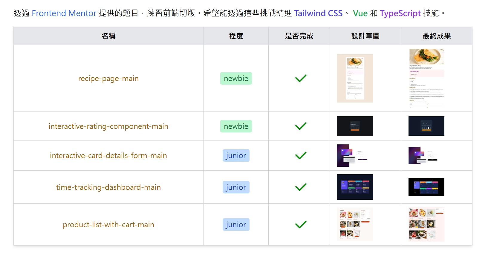

# Tailwind Grid Practice

A collection of five Frontend Mentor challenges built with Vue 3, TypeScript and Tailwind CSS. The home page links to each challenge and displays the reference designs alongside saved implementation screenshots.

I use these exercises to practise CSS Grid and Flexbox, Vue reactive state, form validation and routing. The challenges and designs come from Frontend Mentor; this repository contains my frontend implementations.



## Challenges

| Page | Route | Current implementation |
| --- | --- | --- |
| Recipe page | `/recipe-page-main` | Recipe, preparation time, ingredients, instructions and nutrition information, with a reusable component for recipe sections |
| Interactive rating | `/interactive-rating-component-main` | Select a rating from 1 to 5 and submit it to display a thank-you screen |
| Card details form | `/interactive-card-details-form-main` | Live card preview, format checks for the card number, month, two-digit year and CVC, and a completion screen |
| Time tracking dashboard | `/time-tracking-dashboard-main` | Switch between daily, weekly and monthly views of fixed sample data |
| Product list with cart | `/product-list-with-cart-main` | Adjust quantities, remove items, calculate item counts and totals, display an order confirmation, and clear the cart to start a new order |

Saved screenshots are available in [`src/assets/final-product`](src/assets/final-product). They do not indicate that every device or interaction has been tested. The home page screenshot above predates the English translation.

## Technologies and architecture

- **Vue 3:** Single File Components and the Composition API, using `ref`, `computed` and `watch` to manage page state.
- **TypeScript:** Types for data and component props, checked with `vue-tsc` before building.
- **Vue Router:** Routes for the home page and five challenges. The home page reads difficulty and existing completion flags from route metadata.
- **Tailwind CSS 3:** Utility classes for Grid, Flexbox, spacing, colours and some responsive layouts.
- **Vite:** Development server and production builds. Dynamic images use `import.meta.glob` to resolve asset URLs during the build.
- **Iconify:** Icon components and Tailwind icon utilities. Some icons may be loaded through the Iconify API.

Data and interaction state are held in frontend memory. There is no backend, authentication, database, payment processing or order service. Refreshing the page resets its state.

```text
src/
├── main.ts                 # Vue entry point, router and global icon registration
├── App.vue                 # Router view container
├── router/index.ts         # Routes and challenge metadata
├── layouts/home-layout.vue # Challenge list, reference designs and screenshots
├── views/                  # Five challenge pages and their local state
├── components/             # Reusable recipe section component
└── assets/
    ├── main.css            # Tailwind entry point and font declarations
    ├── design/             # Challenge reference designs
    ├── final-product/      # Saved implementation screenshots
    ├── images/             # Challenge images and SVGs
    └── font/               # Local font files
```

Each challenge manages its own state so that its implementation can be understood independently. The current pages do not need shared state across routes.

## Running locally

Install Node.js and npm. Your Node.js version must meet the Vite `engines` requirement in `package-lock.json`.

```sh
npm ci
npm run dev
```

Open the URL shown in the terminal, usually `http://localhost:5173`.

```sh
npm run build     # Type checking and production build; output goes to dist/
npm run preview   # Preview the production build locally
```

The router uses `createWebHistory()`. Deployment requires the server to fall back to `index.html` for page routes so that direct links and page refreshes work. Hosting under a GitHub Pages subdirectory also requires configuring the Vite base path and routing strategy. A verified live demo is not currently provided.

## Current limitations

- Some pages include responsive styles, but fixed dimensions and absolute positioning remain. Layouts have not been fully checked across phones, tablets and screen sizes.
- Cart quantity controls appear on mouse hover. Touch and keyboard support still need improvement.
- The rating page currently allows submission without selecting a score.
- The card form checks some formats, but required-name validation, expiry-date checks and card-number checksum validation are incomplete. The completion screen's Continue button has no action yet. Use fictional test data.
- Dashboard values are fixed examples, not measurements from a time tracking service.
- There are no automated tests yet. A successful build does not verify all interactions or visual details.

## Design credits

Challenges and reference designs are from [Frontend Mentor](https://www.frontendmentor.io). Reference designs, images and fonts are retained for comparison during practice; I do not claim the challenge designs as my own. This repository does not currently include a licence file. Check the original licences before reusing or redistributing the assets.
